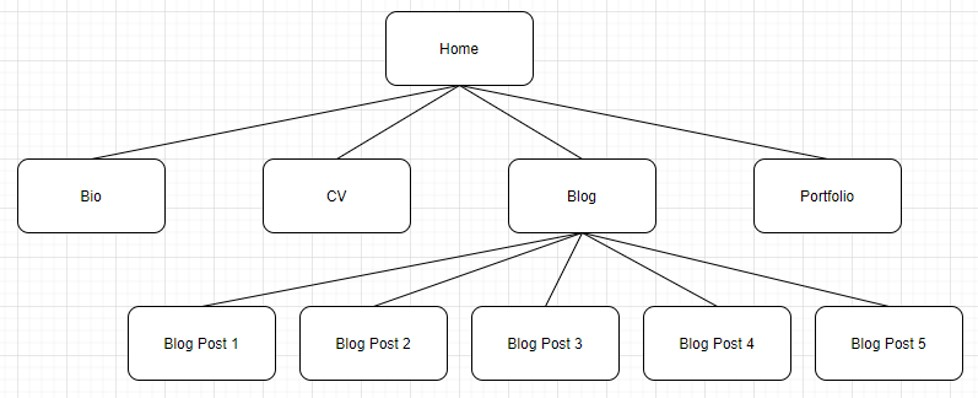

# Grey Joyner Software Portfolio Website
## README file

**Link to site:** http://grey-joyner.netlify.app/

**GitHub repo:** https://github.com/gjoyner09/GreyJoyner_T1A2

**Purpose of site:** Provide an overview of myself, my background and my work to potential employers

**Functionality/features:**
- Homepage providing photo of myself and high-level description
- Bio page with a description of myself
- CV page with detail of my work and study experience
- Portfolio page with work examples and tech stack
- Blog page with links to blog posts
- Blog post pages with blog post text
- Fixed header with links to different pages
- Fixed footer with contact links to LinkedIn, Twitter, Github and email

**Target audience:** potential software development employers

**Tech stack:** HTML, CSS, SCSS, Git, Github, Netlify (for deployment)

**Sitemap:**

**Screenshots:**

